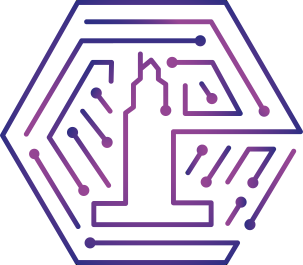

 
<h3>
 HackUDC
</h3>

Created for our first HackUDC edition.

    &nbsp;✦&nbsp;
    <a href="https://www.youtube.com/@talkingtigers">
        YouTube - Talking Tigers
    </a>
    &nbsp;✦&nbsp;

## &#128100; Integrantes

|     | Mote          | Nombre                                        | Usuario | Redirección |
| :-- | :--------------- | :-------------------------------------------- | :--------- | :------------ |
| &#128100;  | `delri` | Martín Del Río Álvarez| delri | [@martindelrioalvarez](https://github.com/martindelrioalvarez) |
| &#128100;  | `castro` | Iago Castro Álvarez| castro | [@castrooo4](https://github.com/castrooo4) |
| &#128100;  | `sarita` | Sara García Currás| sarita | [@saragaarcia](https://github.com/saragaarcia) |
| &#128100;  | `javivi` | Javier Pérez Robles| javivi | [@MiniX16](https://github.com/MiniX16) |

## ✅ Por hacer...

- [ ] Acabar de poner bonito el GitHub
